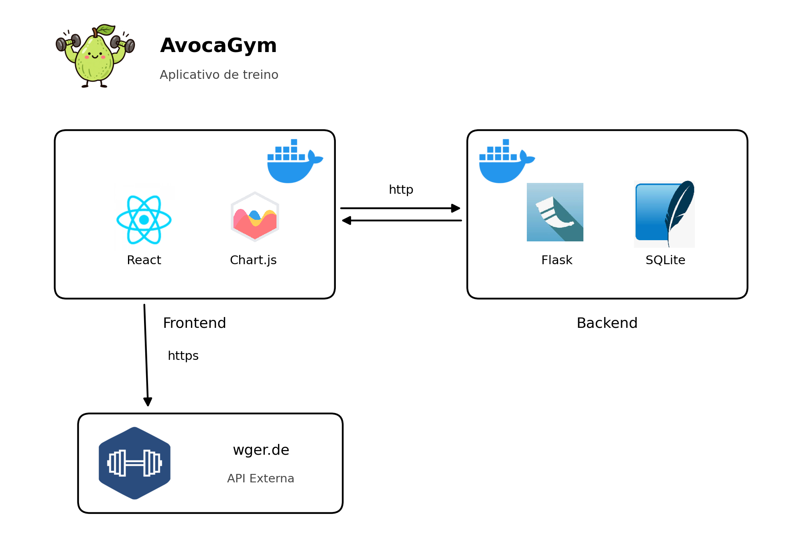

# AvocaGym - Front-end

Interface web do AvocaGym, um aplicativo para registrar treinos de academia. O usuário busca exercícios no catálogo público da [wger.de](https://wger.de), monta o treino do dia (séries, repetições e carga), salva na API própria e acompanha a evolução de carga em um gráfico. O app também exibe dicas de nutrição para reforçar que alimentos de verdade (como frutas) e hidratação importam tanto quanto suplementos.

Projeto desenvolvido como MVP de componentização e microsserviços (Cenário 1 do enunciado: Interface + API própria + API externa).

## Arquitetura



- O **front-end** (React) consulta a **wger.de** diretamente via HTTPS para buscar exercícios. Não há redirecionamento: os dados são tratados e exibidos dentro da própria interface.
- O **front-end** consome a **AvocaGym API** (Flask) via REST para criar, listar, editar e excluir treinos.
- A **AvocaGym API** persiste os dados em **SQLite**.
- Cada componente roda em seu próprio contêiner Docker, com repositório e Dockerfile separados.

Repositório da API própria: informar aqui o link completo do repositório do backend.

## Stack

- React 18 (via CDN, sem etapa de build)
- Chart.js (via CDN) para o gráfico de evolução de carga
- Fetch API para consumir a API própria e a wger.de

## Diferenciais

- Gráfico de evolução de carga (kg) por exercício ao longo do tempo, montado a partir do histórico salvo na API própria
- Filtro por parte do corpo (peito, costas, pernas, ombros, braços, abdômen, cardio...), usando a categoria que já vem em cada exercício da wger.de
- Busca de exercícios com debounce, em português
- Dica de nutrição sorteada a cada abertura do app, com foco em frutas e hidratação
- Filtro por data e paginação na lista de treinos registrados
- Tratamento de erro com aviso claro quando a API própria está fora do ar

## Instalação local

1. Suba a AvocaGym API (veja o README do repositório do backend). Por padrão ela roda em `http://localhost:5000`.
2. Abra o arquivo `index.html` em um navegador.

Se a API estiver em outro endereço, ajuste a constante `API_URL` no topo do `<script>` do `index.html`.

## Rodando via Docker

```bash
docker build -t avocagym-frontend .
docker run -p 8080:80 avocagym-frontend
```

A interface fica disponível em `http://localhost:8080`. A API precisa estar rodando em `http://localhost:5000`.

## API externa utilizada

- **Serviço:** [wger.de](https://wger.de), banco de exercícios open source
- **Licença:** AGPLv3 (uso gratuito, sem necessidade de cadastro ou chave para leitura do catálogo)
- **Rota consumida:** `GET https://wger.de/api/v2/exerciseinfo/?language=7&format=json&limit=999`
  - `language=7` é o código da wger.de para português.
  - O catálogo é carregado uma vez quando a página abre; a busca por nome e o filtro por parte do corpo são feitos localmente a partir desses dados.
- **Observações:**
  - Nem todo exercício da wger.de tem tradução em português cadastrada pela comunidade; só os que têm aparecem na lista.
  - Duas entradas de corrida ("Corrida (esteira/interna)" e "Corrida ao ar livre") foram adicionadas manualmente à categoria Cardio, pois a wger.de não as separa dessa forma.

## Rotas consumidas da API própria

| Método | Rota           | Uso na interface                                       |
|--------|----------------|--------------------------------------------------------|
| GET    | `/treinos`     | Lista de treinos registrados (com filtro e paginação)  |
| POST   | `/treinos`     | Registrar novo treino                                  |
| PUT    | `/treinos/:id` | Editar treino existente                                |
| DELETE | `/treinos/:id` | Excluir treino                                         |
